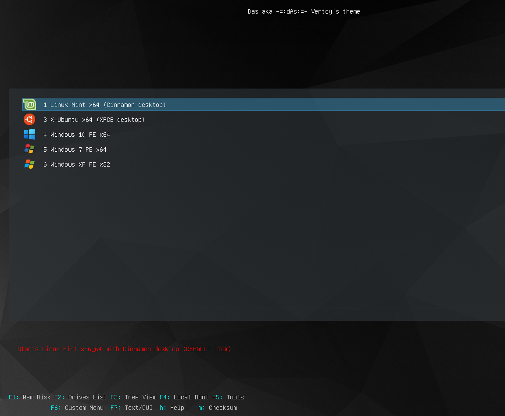

  

[Ventoy Official site](https://www.ventoy.net/) | [Get started with Ventoy](https://www.ventoy.net/en/doc_start.html) | [Download Ventoy](https://www.ventoy.net/en/download.html)

## Ventoy configuration and Theme by -=:dAs:=

### 📃 Features
- nice view
- full list of functional keys
- enabled persistence for **Linux Mint** image

### 🖼 Screenshot

### 🚀 Quick start
- download last version of Ventoy and born it into USB Flash drive
- copy `/theme` folder and `ventoy.json` file
- copy all you need ISO images into `/imgs` folder
- copy persistence images you need to `/persistence` folder into USB Flash drive (see [persistence docs](https://www.ventoy.net/en/plugin_persistence.html)) _For example, to enable persistence for Linux Mint you need the casper-rw image to be downloaded from [Releases section](https://github.com/ventoy/backend/releases)_
- copy distro's icons into `/theme/das/icons` folder (if necessary)
- make changes in the `/ventoy.json` file according to you needs and configuration (see [Documentation](https://www.ventoy.net/en/doc_news.html))

#### 👉 Make sure you made changes in ventoy.json file according to you needs.

###### _Made by -=:dAs:=-_